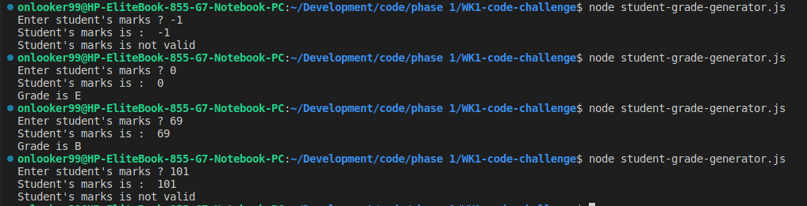
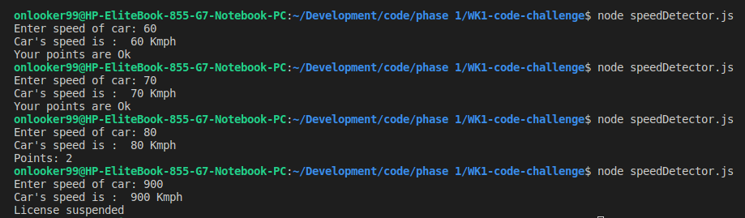

# WEEK-1-CODE-CHALLNGE

# Challenge 1: Student Grade Generator

  ## Instructions
   
   * Write a javascript program that prompts the user to input student marks
   * The input should be between 0 and 100.
   * Then output the correct grade according to the criteria below: 
        A > 79, B - 60 to 79, C -  59 to 49, D - 40 to 49, E - less 40.

  ## Procedure

 ### step 1
 To get user input in nodeJs we use prompt() function
 but we need to install the prompt sync module in our terminal using the below code
  `npm install prompt-sync`

  Then load the module in our .js file using the below code

  ```js
  const prompt = require('prompt-sync')();
  ```
This line below will prompt user to enter a mark and store our input in studentMarks variable 
   ```javascript
       let studentMarks = prompt("Enter student's marks ? ");
       //This line below will display the entered marks back to the user.
        console.log(`Student's marks is :  ${studentMarks}`);

   ```
   
  ### step 2

declare a function called grading where we use else-if to do our grading and console.log the outputs according to our criteria.

  ```javascript

         function grading(studentMarks){
    
    if(studentMarks >= 0 && studentMarks < 40){
        console.log("Grade is E")
    }else if(studentMarks >= 40 && studentMarks < 49   ){
        console.log("Grade is D")
    }else if(studentMarks >= 49 && studentMarks < 59  ){
        console.log("Grade is C")
    }else if( studentMarks >= 60 && studentMarks < 79 ){
        console.log("Grade is B")
    }else if(studentMarks >= 79 && studentMarks < 100 ){
        console.log("Grade is A")
    }else {
        console.log("Student's marks is not valid");
    }
}


   ```
we call the grading function at the end 

  ```js
         grading(studentMarks)

   ```
  ### step 3
  to run the .js file we use the following command in our terminal
    
`node nameOfYourJsFile.js`

   enter any kind of input to see if the code runs successfully     
  
  
# Challenge 2: Speed Detector

## Instructions
* Write a program that takes as input the speed of a car e.g 80. 
* If the speed is less than 70, it should print “Ok”. 
* Otherwise, for every 5 km/s above the speed limit (70), it should give the driver one demerit point and print the total number of demerit points.

 ### step 1
 To get user input in nodeJs we use prompt() function
 but we need to install the prompt sync module in our terminal using the below code
  `npm install prompt-sync`

  Then load the module in our .js file using the below code

  ```js
  const promptSpeed = require('prompt-sync')();
  ```
This line below will prompt user to enter speed and store our input in speed variable 
   ```javascript
       let speed = promptSpeed(`Enter speed of car: `)
      
   ```
### step 2

* Declare a function called speedDetector and put speed from our user input as a parameter to check if the speed is ok or not.

```javascript
     function speedDetector (speed){

     }
```

* Declare an unassigned function using let for storing points of the car

```javascript
    let points;
```
* use if-else statement to check if speed is above 70 to assign points to it

```javascript
    if(speed <=70){
          points = 0;
      }
      else{
          //math.floor- will round off our points the closest point
          points = Math.floor((speed - 70)/5);
      }

  ```
  ### step 3
  * Another else-if statement to check is points and determine what to do with it

```javascript
   if(points <=12 && points >= 0){
        console.log(`Points: ${points}` );
    }
    else if(points >12){
        console.log('License suspended');
    }
    else{
        console.log('Your points are Ok');
    }
```
  * We call the speedDetector function at the end with an argument of speed.

  ```javascript
        speedDetector(speed);
  ```

  ### step 4
  * To run the .js file we use the following command in our terminal
    
`node nameOfYourJsFile.js`

   enter any kind of input to see if the code runs successfully     
  

# Challenge 3: Net Salary Calculator

## Author: 

Stephen Nene. https://github.com/stephen-nene


## License: 

ISC License.