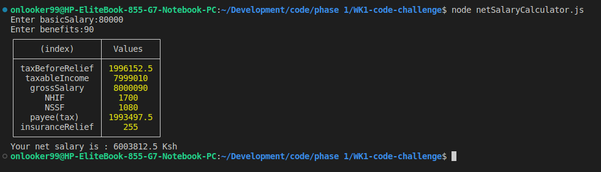

# WEEK-1-CODE-CHALLNGE

# Challenge 1: Student Grade Generator

  ## Instructions
   
   * Write a javascript program that prompts the user to input student marks
   * The input should be between 0 and 100.
   * Then output the correct grade according to the criteria below: 
        A > 79, B - 60 to 79, C -  59 to 49, D - 40 to 49, E - less 40.

  ## Procedure

 ### step 1
 To get user input in nodeJs we use prompt() function
 but we need to install the prompt sync module in our terminal using the below code
  `npm install prompt-sync`

  Then load the module in our .js file using the below code

  ```js
  const prompt = require('prompt-sync')();
  ```
This line below will prompt user to enter a mark and store our input in studentMarks variable 
   ```javascript
       let studentMarks = prompt("Enter student's marks ? ");
       //This line below will display the entered marks back to the user.
        console.log(`Student's marks is :  ${studentMarks}`);

   ```
   
  ### step 2

declare a function called grading where we use else-if to do our grading and console.log the outputs according to our criteria.

  ```javascript

         function grading(studentMarks){
    
    if(studentMarks >= 0 && studentMarks < 40){
        console.log("Grade is E")
    }else if(studentMarks >= 40 && studentMarks < 49   ){
        console.log("Grade is D")
    }else if(studentMarks >= 49 && studentMarks < 59  ){
        console.log("Grade is C")
    }else if( studentMarks >= 60 && studentMarks < 79 ){
        console.log("Grade is B")
    }else if(studentMarks >= 79 && studentMarks < 100 ){
        console.log("Grade is A")
    }else {
        console.log("Student's marks is not valid");
    }
}


   ```
we call the grading function at the end 

  ```js
         grading(studentMarks)

   ```
  ### step 3
  to run the .js file we use the following command in our terminal
    
`node nameOfYourJsFile.js`

   enter any kind of input to see if the code runs successfully     
  
  
# Challenge 2: Speed Detector

## Instructions
* Write a program that takes as input the speed of a car e.g 80. 
* If the speed is less than 70, it should print “Ok”. 
* Otherwise, for every 5 km/s above the speed limit (70), it should give the driver one demerit point and print the total number of demerit points.

### step 1
 To get user input in nodeJs we use prompt() function
 but we need to install the prompt sync module in our terminal using the below code
  `npm install prompt-sync`

  Then load the module in our .js file using the below code

  ```js
  const promptSpeed = require('prompt-sync')();
  ```
This line below will prompt user to enter speed and store our input in speed variable 
   ```javascript
       let speed = promptSpeed(`Enter speed of car: `)
      
   ```
### step 2

* Declare a function called speedDetector and put speed from our user input as a parameter to check if the speed is ok or not.

```javascript
     function speedDetector (speed){

     }
```

* Declare an unassigned function using let for storing points of the car

```javascript
    let points;
```
* use if-else statement to check if speed is above 70 to assign points to it

```javascript
    if(speed <=70){
          points = 0;
      }
      else{
          //math.floor- will round off our points the closest point
          points = Math.floor((speed - 70)/5);
      }

  ```
### step 3
  * Another else-if statement to check is points and determine what to do with it

```javascript
   if(points <=12 && points >= 0){
        console.log(`Points: ${points}` );
    }
    else if(points >12){
        console.log('License suspended');
    }
    else{
        console.log('Your points are Ok');
    }
```
  * We call the speedDetector function at the end with an argument of speed.

  ```javascript
        speedDetector(speed);
  ```

### step 4
  * To run the .js file we use the following command in our terminal
    
`node nameOfYourJsFile.js`

   enter any kind of input to see if the code runs successfully     
  

# Challenge 3: Net Salary Calculator
### step 1
 * To get user input in nodeJs we use prompt() function
 but we need to install the prompt sync module in our terminal using the below code. `npm install prompt-sync`

  * Then load the module in our .js file using the below code

  ```js
  const promptSpeed = require('prompt-sync')();
  ```
* The lines below propmt the iuser to input BasicSalary and benefits
* It then stores the values input by the user in the declared variables

```javascript
    const promptBasicSalary = require(`prompt-sync`)();
    let basicSalary = promptBasicSalary("Enter basicSalary:")
    const promptBenefits = require(`prompt-sync`)();
    let benefits = promptBenefits("Enter benefits:")
```
### step 2

* Declare a function called netSalaryCalculator to display the items calculated by other functions in a table form.

```javascript
    function netSalaryCalculator (){
    const grossSalary = Number(basicSalary + benefits);
    const nssf = calculateNSSF(grossSalary);
    const taxableIncome = grossSalary-nssf;
    const taxBeforeRelief = calculateTax(taxableIncome);
    const personalRelief = 2400;
    const nhif = calculateNHIF(grossSalary);
    const insuranceRelief = nhif*0.15;
    const taxes = taxBeforeRelief-(personalRelief+insuranceRelief);
    const payee = (taxes<=0) ? 0 : taxes;
    const netPay = grossSalary-(nssf + payee + nhif);

    const result = {
        "taxBeforeRelief" : taxBeforeRelief,
        "taxableIncome" : taxableIncome,
        "grossSalary" : grossSalary,
        "NHIF" : nhif,
        "NSSF" : nssf,
        "payee(tax)" : payee,
        // "netPay" : netPay,
        "insuranceRelief" : insuranceRelief
    };

    console.table(result);
    console.log(`Your net salary is : ${netPay} Ksh`)
}
```


### step 3
* Declare a function called calculateNSSF to do as it's name suggests using basicSalary from users input.

```javascript
   function calculateNSSF(basicSalary){
    let nssf;
    if(basicSalary<=6000){
        nssf = basicSalary*0.06;
    }
    else if(basicSalary>6000 && basicSalary<18000){
        nssf = (6000*0.06) + ((basicSalary-6000)*0.06);
    }
    else {
        nssf = 360+720;
    }
    return nssf;
}
```
* Declare another function called calculateTax that uses taxableIncome as it's parameter

```javascript
   function calculateTax(taxableIncome){
    let tax = 0.01;
    if(taxableIncome<=24000){
        tax = taxableIncome*0.1;
    }
    else if(taxableIncome>24000 && taxableIncome<=32,333){
        tax = (24000*0.1)+((taxableIncome-24000)*0.25);
    }
    else{
        tax = (24000*0.1)+((8333)*0.25)+((taxableIncome-32333)*0.3);
    }
    return tax;
}
```
* Our last function is calculateNHIF and its calculates the ammount of NSSF deductions to be used

```javascript
   function calculateNHIF(pay){
    let deduction;
    if(pay<=5999){
        deduction = 150;
    }
    else if(pay>=6000 && pay<8000){
        deduction = 300;
    }
    else if(pay>=8000 && pay<=11999){
        deduction = 400;
    }
    else if(pay >= 12000 && pay <= 14999){
        deduction = 500;
    }
    else if(pay >= 15000 && pay <= 19999){
        deduction = 600;
    }
    else if(pay >= 20000 && pay <= 24999){
        deduction = 750;
    }
    else if(pay >=25000 && pay <=29999){
        deduction = 850;
    }
    else if(pay >=30000 && pay <= 34999){
        deduction = 900;
    }
    else if(pay >= 35000 && pay <= 39999){
        deduction = 950;
    }
    else if(pay >= 40000 && pay <= 44999){
        deduction = 1000;
    }
    else if(pay >= 45000 && pay <= 49999){
        deduction = 1100;
    }
    else if(pay >= 50000 && pay <= 59999){
        deduction = 1200;
    }
    else if(pay >= 60000 && pay <= 69999){
        deduction = 1300;
    }
    else if(pay >= 70000 && pay <= 79999){
        deduction = 1400;
    }
    else if(pay >= 80000 && pay <= 89999){
        deduction = 1500;
    }
    else if(pay >= 90000 && pay <= 99999){
        deduction = 1600;
    }
    else{
        deduction = 1700;
    }

    return deduction;
}
```
we call the netSalaryCalculator function at the end of our program to produce a table of all the items.

  ```js
         netSalaryCalculator();

   ```

### step 4

 to run the .js file we use the following command in our terminal
    
`node nameOfYourJsFile.js`

   enter any kind of input to see if the code runs successfully     
  

## Author: 

Stephen Nene. https:
//github.com/stephen-nene


## License: 

ISC License.